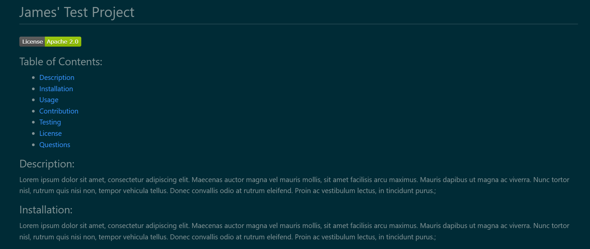
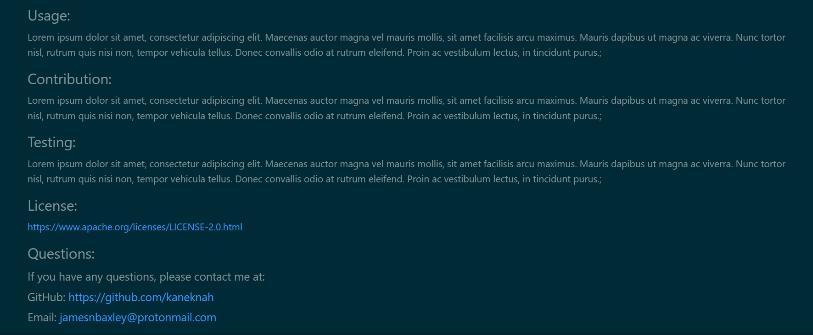

# ch9_baxley_README_generator

Challenge 9 README Generator

## Description

This project was the utilization of Node.js to create README.md file through user input in the terminal. This project is not deployable so a screencastify video can demonstrate its functioning (https://watch.screencastify.com/v/ImtEwbDQIIKN6tBvFokq). The project utilizes the command line to generate questions for the user to answer. These responses are then written to a newREADME.md file though the use of Node.js and the writeToFile functions. Once the application is finished. The newREADME.md file will appear in the repo for reviewing.

The code itself utilizes an array to create the user questions and then passes them and their answers through a renderMarkdown function. all of this utilizes the new node.js fs.writeToFile and exporting features as well as the 'require' feature to connect data from multiple sources together.

The fact that this project utilized no CSS and HTML coding greatly increased the speed in writing the application. Besides several catches with one specific function, this project was perhaps the fastest to complete of all of the challenges so far. this, however, does not mean it was not challenging in utilizing the new Node.js syntax and code.

## User Story

AS A developer 
I WANT a README generator 
SO THAT I can quickly create a professional README for a new project

## Acceptance Criteria

GIVEN a command-line application that accepts user input 
WHEN I am prompted for information about my application repository 
THEN a high-quality, professional README.md is generated with the title of my project and sections entitled Description, Table of Contents, Installation, Usage, License, Contributing, Tests, and Questions 
WHEN I enter my project title 
THEN this is displayed as the title of the README 
WHEN I enter a description, installation instructions, usage information, contribution guidelines, and test instructions 
THEN this information is added to the sections of the README entitled Description, Installation, Usage, Contributing, and Tests 
WHEN I choose a license for my application from a list of options 
THEN a badge for that license is added near the top of the README and a notice is added to the section of the README entitled License that explains which license the application is covered under 
WHEN I enter my GitHub username 
THEN this is added to the section of the README entitled Questions, with a link to my GitHub profile 
WHEN I enter my email address 
THEN this is added to the section of the README entitled Questions, with instructions on how to reach me with additional questions 
WHEN I click on the links in the Table of Contents 
THEN I am taken to the corresponding section of the README

## Installation

The user must first select the package.json file and open it in the integrated terminal and enter "npm i" to install the needed node modules for this application to work.

## Usage

This project can be initiated by typing 'node index' into the terminal(after installation). The user will be prompted to answer several questions regarding the Title, Description, Installation, Usage, Contribution, Testing, License, and Questions sections of the README. as the user inputs and selects the answers for these questions, as well as other identifying information, the application will then generate a clean README file displaying this information in a .md format.

## Credits

Starter Code provided by Berkely Bootcamp.

## License

N/A
